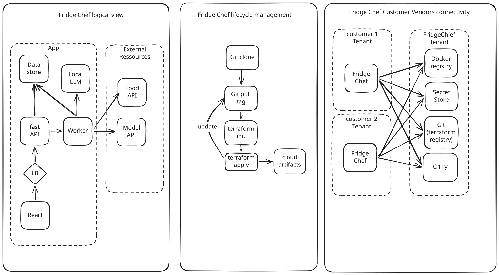

# Fridge Chef goes Enterprise

> Disclaimer: AWS names are used for simplicity, but Azure equivalents
> exist throughout.

## Starting hypothesis

- The product runs in the customer tenant.
- There is **no ingress** access to customer tenants from the Fridge Chef
  team.
- Customer tenant **egress** is allowed to: the git repo, a private ECR,
  a secret store, and observability.

## Design decisions

### 1. Underlying infrastructure

| Option | Characteristics |
|---|---|
| **Kubernetes** | Uniformity across clouds; feature-full; large adoption; infra via Crossplane; excellent scalability; security out of the box; **high maintenance**. |
| **Image + VM** | High control; easy to deploy; infra via embedded Terraform; good scalability through ASGs; **building and managing images is too much of a burden**. |
| **ECS + Terraform** | Uniformity across clouds; few features; security is harder; good-enough scalability; **low maintenance**. |

**Decision: ECS.** It stands out as the most suitable choice for this use
case. The application already runs in Docker containers, ECS scales, and
maintenance is the lowest of the three options.

### 2. Distribution to customer tenant

**Preliminary assumptions.** Distribution goes through two channels: an
ECR in the Fridge Chef tenant, and a git repo. The customer is able to
sync the git repo and run Terraform.

Because there is no easy access to customer tenants, distribution is one
of the most critical parts. Two main options:

| Option | Notes |
|---|---|
| **Marketplace** | Easy for customers -- normally a few clicks. Requires maintaining as much code as we have clouds (CloudFormation-stack-like). Installation happens only once; for ~15 customers it is not worth the effort (revisit in the future). Upgrades are impractical because they are managed outside the store. |
| **Git** | The customer clones a git repo at a particular tag (a release) containing the Terraform that manages the infra lifecycle. The same repo also acts as a Terraform registry. |

There must be a **clear, agreed list of prerequisites** with the customer
before any installation is attempted (mainly AWS/Azure rights).

**Decision: Git.** It is the best choice under the current conditions.

### 3. Product lifecycle

Managed with Terraform, distributed through the channel described in §2.

### 4. Observability

Observability is paramount in an environment that is air-gapped from us.
To get visibility, run a Prometheus in **push mode** in each customer
tenant, sending metrics to a central Prometheus. That gives a single pane
of glass for customer status: version running, Terraform drift, errors,
etc.

Compliance-wise, this egress flow to our monitoring platform should be
acceptable as long as every log message is documented and no sensitive
data is sent.

### 5. Security

- **API keys / secrets sharing:** give customers access to secret stores
  in the Fridge Chef tenant.
- **Certificates** for our API endpoint should be signed using AWS/Azure
  Private CA.
- **For later:** consider mTLS.
- **Auditability** is provided by the cloud audit feature out of the box.
- Define a **key-compromise / secret-rotation runbook**.

### 6. Scale and ergonomics

*What is the limit of this model with two people and a growing customer
base?*

In a perfect world -- no failures, tech-savvy customers -- it can scale a
lot. The product is designed for robustness; each customer decides when to
upgrade by switching to the tag they want in the repo; observability
monitors deployment health and status.

Realistically it depends on upgrade frequency and whether customers need
assistance during upgrades:

- If customers upgrade every two weeks to benefit from the Fridge Chef
  team's velocity, the platform team risks spending all its time helping
  with upgrades.
- If high velocity makes the product less reliable, a large share of time
  goes to calling customers to fix issues.

### 7. Support and operations

*How to deal with an issue at a customer site with no access to the infra
-- first 30 minutes.*

1. System-down at the customer site is detected by observability, which
   alerts the on-call engineer.
2. The engineer checks the customer's deployment status on their
   dedicated dashboard and reviews the alarm received.
3. If a runbook exists, follow it. If unknown, assess the situation to get
   a clear picture of the recovery steps before calling the customer;
   escalate for more help if needed.
4. Reach the customer's on-call engineer, offering to assist with recovery
   on a shared session or to explain the recovery steps over the phone.
5. Confirm the customer's deployment is up and running again on the
   customer dashboard, and ask the customer to confirm everything works as
   expected.

### 8. Diagrams

Three views: the logical view of a customer tenant, lifecycle management,
and Fridge Chef / customer / vendor connectivity.
